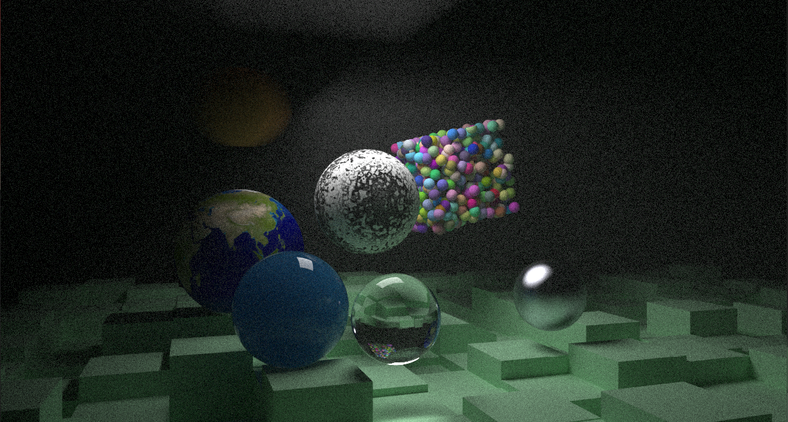
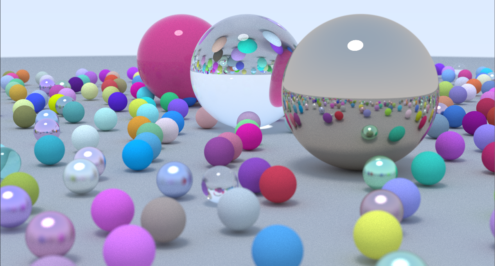
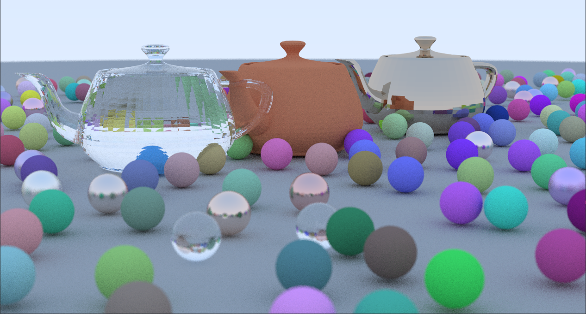
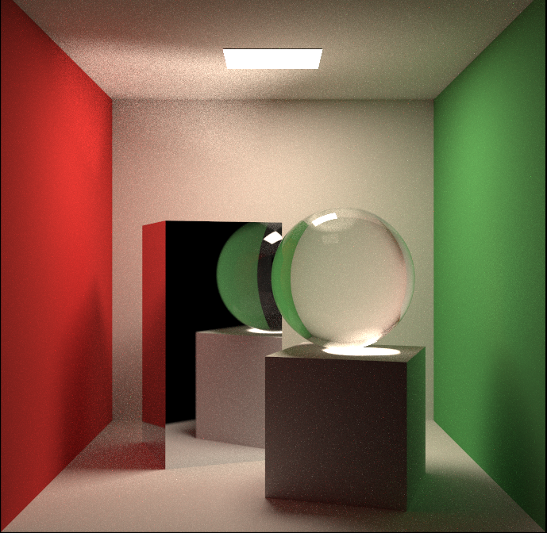
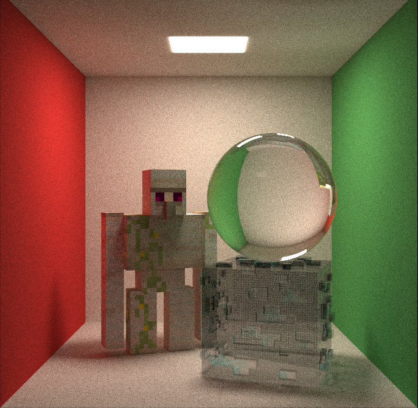

# cpp-raytracer

## Overview
Cpp-Raytracer is a ray tracing project implemented in C++. It features a bounding volume hierarchy (BVH) for efficient ray-object intersection tests.
You can render various shapes, materials, and textures with the ray tracer. You can also import custom models with the Wavefront OBJ format.

## Features
- Ray tracing
- Bounding Volume Hierarchy (BVH)
- Various geometric shapes, materials, and textures
- Efficient intersection tests
- Import custom models with the Wavefront OBJ format

## Images
Here are some sample images generated by the ray tracer:

### Mashup of various shapes, textures, and materials

### Random Spheres

### Random Spheres with Teapots

### Cornell Box

### Cornell Box..., but Minecraft!

## References
- [Ray Tracing in One Weekend](https://raytracing.github.io/books/RayTracingInOneWeekend.html)
- [Utah Teapot](https://graphics.stanford.edu/courses/cs148-10-summer/as3/code/as3/teapot.obj)
- [Cornell Box](https://www.graphics.cornell.edu/online/box/)
- [Iron Golem](https://sketchfab.com/3d-models/minecraft-iron-golem-a34d28d5761040559d669e77090cbfaf#download)
- [Diamond Ore](https://sketchfab.com/3d-models/diamond-ore-fc465aea0ed04475805b44fde5099578)